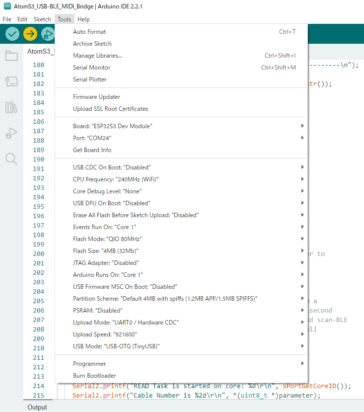
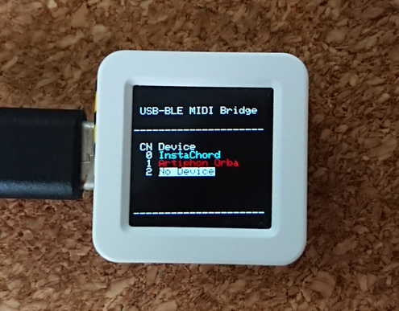

# USB-BLE MIDI Bridge for AtomS3

This project provide MIDI Bridge between USB and BLE

## Capability
- 3 virtual cable support
- BLE MIDI auto reconnection

## Target Device 
[AtomS3(M5Stack)](https://docs.m5stack.com/en/core/AtomS3)

## Requirement
### Board manager
[Arduino core for the ESP32, ESP32-S2, ESP32-S3, ESP32-C3, ESP32-C6 and ESP32-H2](https://github.com/espressif/arduino-esp32)

[M5Unified](https://github.com/m5stack/M5Unified)

[Arduino MIDI Library](https://github.com/FortySevenEffects/arduino_midi_library)

[Arduino BLE-MIDI Transport(connection_compatibility branch on my forked vertion)](https://github.com/aselectroworks/Arduino-BLE-MIDI/tree/connection_compatibility)

[Arduino USB-MIDI Transport(multi-cable-support branch on my forked version)](https://github.com/aselectroworks/Arduino-USBMIDI/tree/multi-cable-support)

[MIDIUSB Library for arduino-esp32](https://github.com/aselectroworks/MIDIUSB_ESP32)

Thank you for all contributors of related projects🎉

## How to use
1. Build this project and flash to AtomS3. Board setting example is below. `USB Mode` must set to `USB-OTG (TinyUSB)`

    
2. Click the display(AtomS3 has the button under the display), move the cursor. 
3. Press and hold the display, enter or execute some function(scan/connect/remove). 

### Displaying Information
- Displaying the bonded device name
- CN = Virtual Cable Number
- Blue string device is connecting
- Red string device is disconnected

    